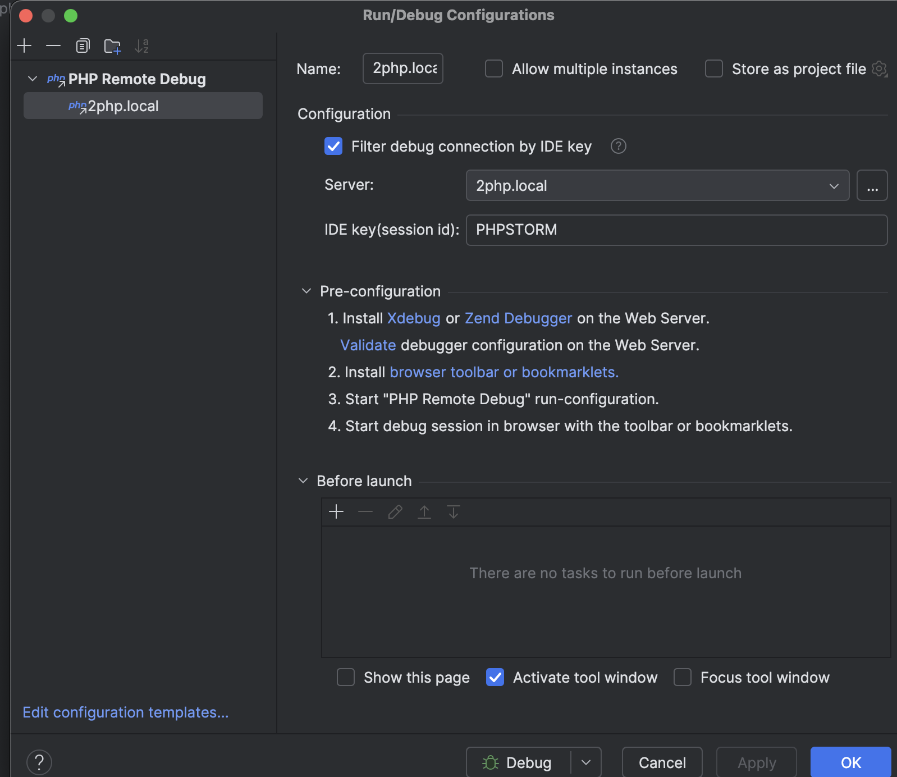
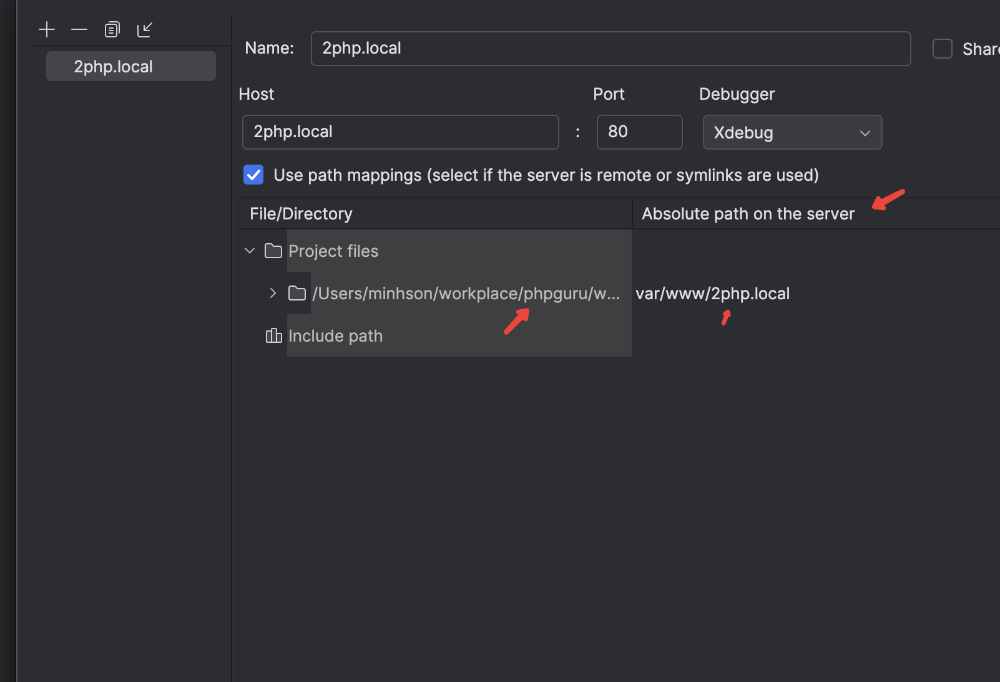
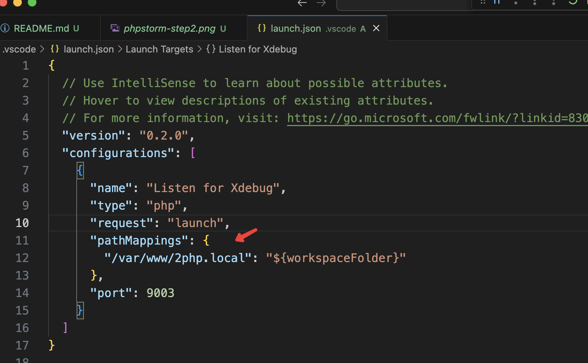

# 2php.local

## How to debug

### Enable Xdebug

```
[xdebug]
zend_extension=xdebug
xdebug.mode=debug
xdebug.client_host=localhost
xdebug.client_port=9003
```

### PHPStorm

**Step1**



**Step2**


### VSCode


